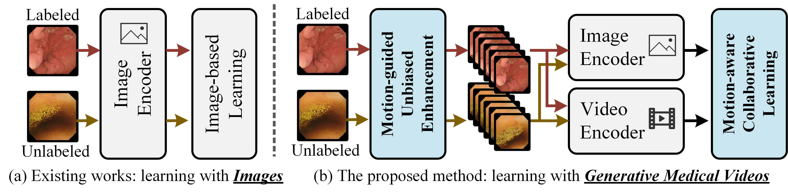

# [MICCAI' 24] From Static to Dynamic Diagnostics: Boosting Medical Image Analysis via Motion-Informed Generative Videos

📌 This is an official PyTorch implementation of **[MICCAI 2024]** - From Static to Dynamic Diagnostics: Boosting Medical Image Analysis via Motion-Informed Generative Videos

> [**From Static to Dynamic Diagnostics: Boosting Medical Image Analysis via Motion-Informed Generative Videos**]() 
> [Wuyang Li1](https://wymancv.github.io/wuyang.github.io/), [Xinyu Liu1](https://xinyuliu-jeffrey.github.io/), [Qiushi Yang2](https://qiushiyang.github.io/), [Yixuan Yuan1](http://www.ee.cuhk.edu.hk/~yxyuan/) 1 The Chinese Univerisity of Hong Kong; 2 City University of Hong Kong

Our code will be released later.
 Contact: [Wuyang Li](https://wymancv.github.io/wuyang.github.io/)

    

